# Casino Simulator UML

The current editable Mermaid model is below.

```mermaid
classDiagram
    direction LR

    class CasinoRunner {
        +main(String[] args)$ void
    }

    class CasinoBatchRunner {
        +main(String[] args)$ void
    }

    class CasinoSimulationEngine {
        +runRound(Casino casino)$ void
        ~runPreGameStage(Casino casino)$ void
        ~runInGameStage(Casino casino)$ Map
        ~runPostGameStage(Map completedRounds)$ void
    }

    class Casino {
        -double revenue
        -ArrayList~Player~ players
        -ArrayList~Staff~ staffs
        -ArrayList~Game~ casinoFloor
        -ArrayList~PlaySessionRecord~ playRecords
        +addPlayer(...)
        +addStaff(...)
        +addGame(...)
        +loadSimFromFile(String path)
        +saveSimToFile(String path)
        +blacklistPlayer(...)
        +kickPlayer(...)
        +rigOdds(...)
    }

    class CasinoControls {
        -double pokerRakeRate
        -int pokerRakeCap
        -double slotRtp
        -int playerProfitLimit
        +shouldRemoveForProfit(Player player) boolean
    }

    class Player {
        -int id
        -String name
        -int balance
        -boolean blacklisted
        -PlayerProfile profile
        -CasinoVisitState visitState
        -ArrayList~PlaySessionRecord~ playHistory
        -PlaySessionRecord currentSession
        +joinTable(Game game) PlaySessionRecord
        +leaveTable() boolean
        +leaveCasino()
        +getEmotionalStatus() PlayerEmotionalStatus
        +updateEmotionalStatusAfterRound(TableEnvironment)
        +placeBet(int amount) boolean
        +addWinnings(int amount)
        +chooseBlackjack(Blackjack game) int
        +chooseRoulette(Roulette game) int
        +calculateBetAmount(int min, int max) int
    }

    class PlayerProfile {
        -BankrollStyle bankrollStyle
        -BehaviorStyle behaviorStyle
        -double socialSensitivity
        -double winSensitivity
        -double lossSensitivity
        -DecisionThresholds decisionThresholds
        -PlayerFactualStatus emotionalStatus
    }

    class PlayerEmotionalStatus {
        -double mood
        -double momentum
        -double socialScore
        -double tilt
        +update(Player, PlaySessionRecord, TableEnvironment)
    }

    class PlayerFactualStatus {
        -int roundsPlayed
        -int roundsAtTable
        -int winStreak
        -int lossStreak
        -int lastRoundNet
        -long lastRoundWagered
        -double socialSurrounding
        -int startingBankroll
        -int currentBankroll
        +update(Player, PlaySessionRecord, TableEnvironment)
    }

    class CasinoVisitState {
        -int startingBalance
        -int ticksInCasino
        -int tableSwitches
        -boolean inCasino
    }

    class BankrollStyle {
        <<enumeration>>
        HIGH_ROLLER
        EVEN_STEVEN
        LOW_ROLLER
    }

    class BehaviorStyle {
        <<interface>>
        +preferenceFor(Game game) double
        +getDefaultPokerTraits() PokerTraits
    }

    class WhaleStyle
    class GrinderStyle
    class LowStakesStyle
    class ObnoxiousStyle

    class Game {
        <<abstract>>
        -int id
        -int maxTablePopulation
        -int minBet
        -int maxBet
        -int profit
        #ArrayList~Player~ currentTable
        #Action[] actions
        -ArrayList~PlaySessionRecord~ playerHistory
        +addPlayer(Player player) boolean
        +removePlayer(Player player) boolean
        +collectBet(Player player, int amount) boolean
        +distributeWinnings(Player player, int amount)
        +simulateRound()* void
    }

    class Blackjack {
        -int[] deck
        -int count
        +dispellCard() int
        +simulateRound()
    }

    class Roulette {
        -ArrayList~Integer~ riggedNums
        +simulateRound()
    }

    class Slots {
        -char[][] screen
        -char[] weightedSymbols
        -Action[] paytable
        +spinMachine(Player player)
        +simulateRound()
    }

    class Action {
        -int id
        -String name
        -double standardOdds
        -double actualOdds
        -double payoutRatio
    }

    class PlaySessionRecord {
        -Player player
        -Game game
        -int totalWinnings
        -int tableWins
        -int tableLosses
        +getWinRate() double
    }

    class Staff {
        -String name
        -int blacklistCount
        +blacklistPlayer(Player player) boolean
    }

    class Security {
        -int playerKickCount
        +kickPlayer(Player player) boolean
    }

    class FloorManager {
        +checkGameStats(Game game) boolean
        +checkPlayerStats(Player player) boolean
        +rigGame(Game game, int action, double odds) boolean
    }

    Player *-- PlayerProfile
    Player *-- CasinoVisitState
    PlayerProfile *-- PlayerFactualStatus
    PlayerEmotionalStatus <|-- PlayerFactualStatus
    PlayerProfile *-- BankrollStyle
    PlayerProfile *-- BehaviorStyle
    BehaviorStyle <|.. WhaleStyle
    BehaviorStyle <|.. GrinderStyle
    BehaviorStyle <|.. LowStakesStyle
    BehaviorStyle <|.. ObnoxiousStyle

    Game <|-- Blackjack
    Game <|-- Roulette
    Game <|-- Slots

    Staff <|-- Security
    Staff <|-- FloorManager

    CasinoRunner ..> Casino : interactive setup
    CasinoRunner ..> CasinoSimulationEngine : runs rounds
    CasinoBatchRunner ..> CasinoSimulationEngine : runs rounds
    CasinoSimulationEngine ..> Casino : updates
    Casino "1" o-- "0..*" Player : manages
    Casino "1" o-- "0..*" Game : casino floor
    Casino "1" o-- "0..*" Staff : employs
    Casino "1" o-- "0..*" PlaySessionRecord : stores
    Casino *-- CasinoControls : owns

    Game "1" *-- "1..*" Action : offers
    Game "0..1" o-- "0..*" Player : current table
    Player "1" -- "0..*" PlaySessionRecord : play history
    Game "1" -- "0..*" PlaySessionRecord : session history
    PlaySessionRecord "0..*" --> "1" Player : identifies
    PlaySessionRecord "0..*" --> "1" Game : records

    Staff ..> Player : monitors
    FloorManager ..> Game : inspects / rigs
```

## Runtime flow

1. `CasinoRunner` creates a `Casino` and handles menu input.
2. `Casino` owns the collections of players, staff, games, and session records.
3. A `Player` joins a `Game`; this creates one `PlaySessionRecord` referenced by both objects.
4. **Pre-game:** each player decides whether to leave, stay, switch, or select an affordable table.
5. **In-game:** `CasinoRunner` calls each game's polymorphic `simulateRound()` implementation; games only handle game rules and money flow.
6. **Post-game:** session accounting is checkpointed, then `PlayerFactualStatus.update(...)` records bankroll, social surroundings, and round facts while inherited emotional logic updates mood, momentum, smoothed social score, and tilt.
7. The next pre-game decision reads that completed emotional status.
8. `Security` can remove players; `FloorManager` can inspect statistics or modify an `Action`'s actual odds.
